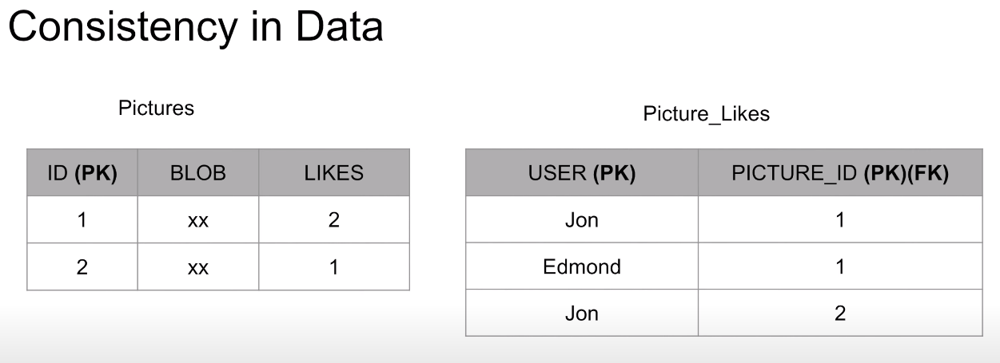

# ACID

## 1. Atomicity
- All queries must succed. If one fails ll should rollback 

There are further more queries need to be done after the update query but for some reasons the database crashed. The balance has just gone. Like, I sent $ 100 to somebody but nobody gets it.

## 2. Isolation
- Can my inflight transaction see changes made by other transactions?
- Read phenomena
    - Dirty Reads
  
        
 

    - Non-repeatable read
  
        
 
    - Phantom read
  
        
 
- Isolation Levels
  - Read uncommitted -> No isolation. Any change from the outside is visible to the transaction.
  - Read committed -> Each query in a transaction only sees committed stuff.
  - Repeatable Read -> Each query in a transaction only sees committed updates at the beginning of transaction.
  - Serializable -> Trasnactions are serialized.
  
    
 
## 3. Consistency
- Consistency in Data
  - Defined by the user
  - Referential integrity (foreign keys)
  - Atomicity
  - Isolation
  
    
 
 
- Consistency in reads
  - If a tansaction committed a change will a new transaction immediately see the change?
  - Relational and NoSQL databases suffer from this
  - Eventual consistency

## 4. Durability
- Committed transactions must be persisted in a durable non-volatile storage